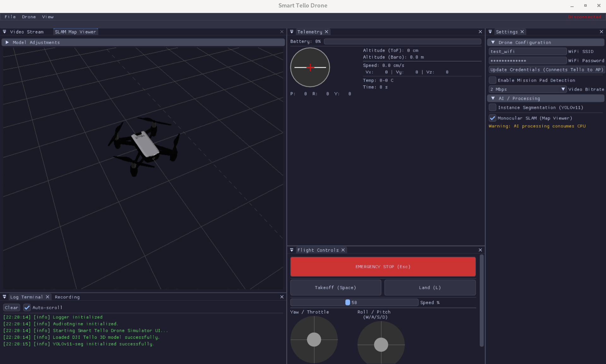
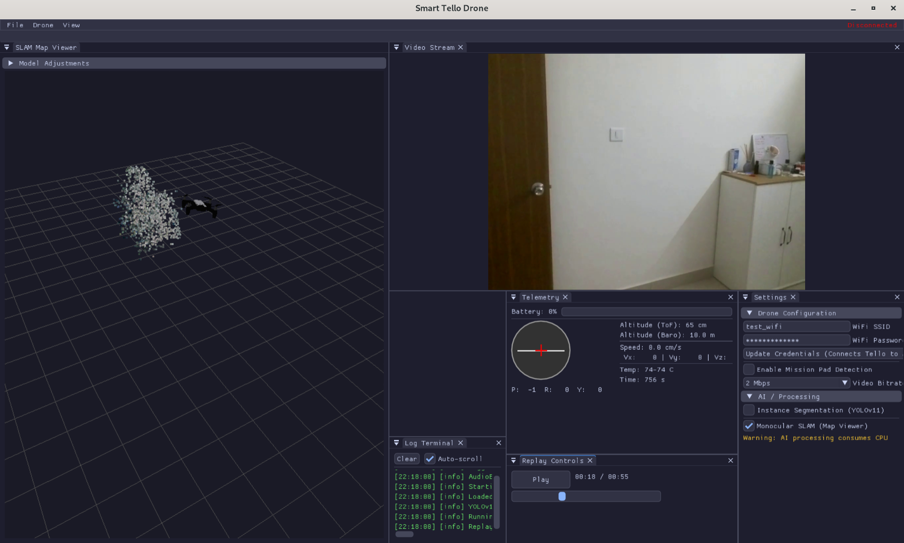

# Smart Tello Drone (Work-in-Progress)

A feature-rich ground station and flight control application for the [DJI Tello](https://www.ryzerobotics.com/tello) drone, built in C++17. Combines real-time video streaming, visual SLAM, AI-powered instance segmentation, telemetry logging, and flight session replay — all within a modern ImGui-based desktop interface.

## Screenshots





## Features

### 🎮 Flight Control
- Full flight command support via the Tello SDK 1.3 protocol (takeoff, land, directional movement, rotation, flips)
- RC-style continuous control with keyboard input
- Configurable flight speed with PID-based control utilities
- Emergency stop support

### 📹 Live Video & Recording
- Real-time H.264 video decoding from the Tello's UDP stream using FFmpeg
- Video recording to MP4 with configurable FPS
- Session replay with synchronized video and telemetry playback

### 📊 Telemetry
- Real-time telemetry display: attitude (yaw/pitch/roll), velocity, acceleration, height, ToF distance, battery, temperature
- Telemetry logging to timestamped CSV files at ~10 Hz
- Historical telemetry plots in the GUI

### 🗺️ Visual SLAM & 3D Visualization
- Monocular visual odometry using OpenCV feature tracking (Shi-Tomasi + Lucas-Kanade optical flow)
- Essential matrix decomposition for camera pose estimation
- 3D point cloud generation with per-point RGB color sampled from video frames
- Interactive 3D map viewer with orbit camera controls
- DJI Tello 3D model rendering (GLB format via cgltf) with proper node hierarchy, per-primitive materials, and lighting
- Coordinate system synchronization between OpenCV (Y-down, Z-forward) and OpenGL (Y-up, Z-backward)
- Point cloud export to PLY format (compatible with MeshLab, CloudCompare, Blender)

### 🧭 Multi-Mode Pose Estimation
Three pose estimation modes for different use cases:

| Mode | Input | Description |
|------|-------|-------------|
| **Video Only** | Camera feed | Pure visual odometry from feature tracking |
| **Telemetry Only** | IMU data | Dead reckoning from velocity integration + attitude sensor |
| **Fused** | Both | VO rotation with telemetry-derived scale + height sensor |

- Automatic mode selection based on available inputs
- Height-aware depth estimation using the drone's ToF/IR sensor instead of arbitrary depth assumptions
- Automatic video-telemetry synchronization via filename timestamp parsing (`YYYYMMDD_HHMMSS`)
- Manual sync offset adjustment slider for fine-tuning alignment

### 🤖 AI Instance Segmentation
- Real-time instance segmentation using [YOLOv11-seg](https://docs.ultralytics.com/models/yolo11/) (ONNX format) via OpenCV DNN
- 80-class COCO object detection with per-instance mask overlays
- Pluggable `FrameProcessor` architecture for adding custom vision pipelines
- Toggle on/off from the settings panel

> **Model Attribution**: The instance segmentation model (`yolo11n-seg.onnx`) is based on [Ultralytics YOLOv11](https://github.com/ultralytics/ultralytics), licensed under [AGPL-3.0](https://github.com/ultralytics/ultralytics/blob/main/LICENSE). See the [Ultralytics documentation](https://docs.ultralytics.com/) for model details, training, and usage terms.

### 🔊 Audio
- Audio feedback engine using miniaudio for flight events

## Architecture

```
src/
├── ai/                 # AI vision pipeline
│   ├── FrameProcessor  # Abstract interface for video processors
│   ├── Segmentation    # YOLOv11-seg instance segmentation
│   └── ObjectTracker   # Object tracking utilities
├── core/               # Drone communication & data
│   ├── TelloSDK        # UDP command/state/video protocol
│   ├── VideoDecoder    # FFmpeg H.264 decoding
│   ├── TelemetryLogger # CSV telemetry logging
│   ├── Recorder        # Video recording (MP4)
│   └── ReplaySession   # Synchronized video+telemetry playback
├── gui/                # ImGui interface panels
│   ├── AppGui          # Main application layout & dockspace
│   ├── ControlPanel    # Flight controls & keyboard input
│   ├── VideoWindow     # Live video display
│   ├── TelemetryPanel  # Real-time telemetry graphs
│   ├── RecordingPanel  # Record/stop controls
│   ├── ReplayPanel     # Session replay with seek
│   ├── SettingsPanel   # Configuration (speed, SLAM, YOLO)
│   ├── LogTerminal     # spdlog output terminal
│   └── Theme           # Custom dark theme
├── slam/               # Visual SLAM system
│   ├── SLAMEngine      # VO + dead reckoning + sensor fusion
│   └── MapViewer       # 3D OpenGL visualization + model loader
└── utils/              # Shared utilities
    ├── PID             # PID controller
    ├── Logger          # spdlog initialization
    └── AudioEngine     # miniaudio wrapper
```

## Prerequisites

### System Dependencies

| Dependency | Version | Purpose |
|-----------|---------|---------|
| CMake | ≥ 3.20 | Build system |
| OpenCV | ≥ 4.x | Computer vision, DNN, video I/O |
| FFmpeg | libavcodec, libswscale, libavutil | H.264 video decoding |
| Eigen3 | ≥ 3.x | Matrix operations for SLAM |
| spdlog | — | Structured logging |
| yaml-cpp | — | Configuration file parsing |
| OpenGL | — | 3D rendering |
| pkg-config | — | Dependency resolution |

### Ubuntu / Debian

```bash
sudo apt install -y \
  cmake build-essential pkg-config \
  libopencv-dev \
  libavcodec-dev libswscale-dev libavutil-dev \
  libeigen3-dev \
  libspdlog-dev \
  libyaml-cpp-dev \
  libgl-dev
```

### Vendored Dependencies (Git Submodules)

These are included in `vendor/` and built automatically:

- **[GLFW](https://github.com/glfw/glfw)** — Windowing and OpenGL context
- **[Dear ImGui](https://github.com/ocornut/imgui)** — Immediate-mode GUI (with docking branch)
- **[cgltf](https://github.com/jkuhlmann/cgltf)** — GLB/glTF 3D model loading (header-only)
- **[miniaudio](https://github.com/mackron/miniaudio)** — Audio playback (header-only)

## Building

```bash
# Clone with submodules
git clone --recursive https://github.com/Gauthamraju31/smart_tello_drone.git
cd smart_tello_drone

# Build
mkdir -p build && cd build
cmake ..
make -j$(nproc)
```

## Usage

### Main Application

Connect to the Tello drone's Wi-Fi network, then:

```bash
./SmartTelloDrone
```

The application will:
1. Connect to the drone at `192.168.10.1`
2. Open the video stream
3. Start telemetry logging to `logs/`
4. Display the full GUI with video, controls, telemetry, and SLAM viewer

### SLAM Test Tool

A standalone tool for testing SLAM visualization without a drone connection:

```bash
# Video only (webcam)
./test_slam_gui

# Video file
./test_slam_gui path/to/video.mp4

# Telemetry only (no video)
./test_slam_gui none logs/telemetry_20260301_184820.csv

# Video + Telemetry (fused mode, auto-synced by filename timestamps)
./test_slam_gui recordings/vid_20260225_220421.mp4 logs/telemetry_20260225_220359.csv
```

Controls:
- **Left-click + drag** — Orbit camera
- **Scroll** — Zoom in/out
- **Pose Mode dropdown** — Switch between Video Only / Telemetry Only / Fused
- **Sync Offset slider** — Fine-tune video-telemetry alignment
- **Export Point Cloud** — Save to `slam_pointcloud.ply`

### Configuration

Edit `config/settings.yaml`:

```yaml
drone:
  speed: 50              # Flight speed (10-100 cm/s)

features:
  slam_enabled: true     # Enable visual SLAM
  yolo_enabled: false    # Enable YOLOv11 segmentation
```

Camera calibration is stored in `config/tello_calib.yaml`.

## Tests

```bash
cd build
ctest --output-on-failure
```

| Test | Description |
|------|-------------|
| `test_pid` | PID controller unit tests |
| `test_telemetry_parser` | Telemetry CSV parsing validation |
| `test_tello_sdk` | SDK connection and protocol tests |
| `test_slam_gui` | Interactive SLAM visualization tool |

## Project Assets

| File | Description |
|------|-------------|
| `model/dji_tello.glb` | 3D model of DJI Tello for SLAM viewer |
| `model/yolo11n-seg.onnx` | YOLOv11-seg nano model ([Ultralytics](https://github.com/ultralytics/ultralytics)) |

## Acknowledgements

- **[Ultralytics](https://github.com/ultralytics/ultralytics)** — YOLOv11 instance segmentation model, licensed under AGPL-3.0
- **[DJI / Ryze Robotics](https://www.ryzerobotics.com/)** — Tello SDK documentation and protocol specification
- **[Dear ImGui](https://github.com/ocornut/imgui)** — Immediate-mode GUI framework by Omar Cornut
- **[OpenCV](https://opencv.org/)** — Computer vision library
- **[Eigen](https://eigen.tuxfamily.org/)** — Linear algebra library

## License

This project is licensed under the [MIT License](LICENSE).

Copyright © 2022 Gautham Raju
